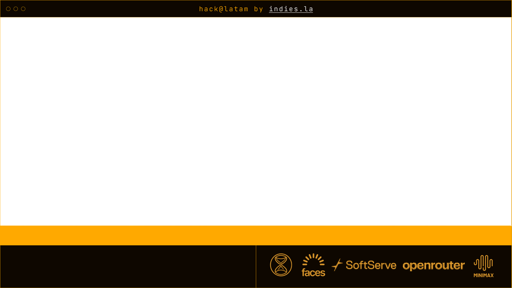

# stream-v2

Overlays para el stream del demo day (hack@latam by indies.la). Se sirven con un servidor local en `http://localhost:4000` y se montan en OBS como **Browser Sources** sobre transparencia.



---

## 1. Levantar el servidor local

Requiere Node 18+.

```bash
npm install
npm start
```

El servidor queda corriendo en `http://localhost:4000` y expone:

- `/admin` → panel para cargar hackers, mandar a stage y manejar el timer.
- `/iframes/*.html` → los overlays que se cargan en OBS.
- `/api/live` → endpoint que consumen los iframes (mismo origen).
- `/data/state.json` → estado persistido (hackers, stage actual, timer).

Mientras corra el servidor todo el estado se guarda en `data/state.json`. Si lo matás y lo levantás de nuevo, recupera lo último.

## 2. Cargar hackers y manejar el stream desde `/admin`

Abrir `http://localhost:4000/admin` en el navegador:

1. Pegar la lista de hackers (uno por línea, opcionalmente con `@github`).
2. Seleccionar el hacker que está presentando → aparece en los overlays de `names`/`team`.
3. Setear duración y arrancar el `timer` cuando empieza el pitch.

Todo lo que toques acá se refleja en vivo en los iframes que ya estén abiertos en OBS (poll cada ~1s).

## 3. Montar los overlays en OBS

Para cada overlay agregar una fuente **Browser** en OBS:

| Overlay      | URL                                          | Tamaño recomendado |
|--------------|----------------------------------------------|--------------------|
| Hackathon    | `http://localhost:4000/iframes/hackathon.html` | 1920 × 1080        |
| Names        | `http://localhost:4000/iframes/names.html`     | 1920 × 1080        |
| Sponsors     | `http://localhost:4000/iframes/sponsors.html`  | 1920 × 1080        |
| Team         | `http://localhost:4000/iframes/team.html`      | 1920 × 1080        |
| Timer        | `http://localhost:4000/iframes/timer.html`     | 1920 × 1080        |

Para cada Browser Source:

- **URL**: la de arriba.
- **Width / Height**: 1920 × 1080 (o el tamaño del canvas).
- **Custom CSS**: dejar el default (`body { background: rgba(0,0,0,0); ... }`) — los iframes ya son transparentes.
- ✅ **Shutdown source when not visible** y ✅ **Refresh browser when scene becomes active** ayudan a evitar overlays "colgados" entre escenas.

> Tip: si OBS no muestra cambios, click derecho sobre la fuente → **Refresh**. Si no se ve nada, verificá que `npm start` siga corriendo.

## 4. Escenas de OBS (opcional)

En `obs stuff/ESCENAS.json` hay una exportación de la colección de escenas que usamos. Para importarla:

OBS → **Scene Collection** → **Import** → seleccionar `obs stuff/ESCENAS.json`.

Las stream keys reales **no** están en el repo (gitignoreadas en `obs stuff/perfil obs/service.json`). Hay que cargarlas a mano en OBS → **Settings → Stream**.

## 5. Estructura

```
admin/index.html        Panel de control (hackers, stage, timer)
iframes/*.html          Overlays que se cargan en OBS
assets/                 SVGs/PNGs usados por los iframes
data/state.json         Estado persistido del servidor
obs stuff/              Colección de escenas de OBS
server.js               Servidor Express
```

## 6. Troubleshooting

- **El iframe queda en blanco** → el servidor no está corriendo, o no es el puerto 4000.
- **El nombre no cambia al apretar "Send to stage"** → revisar consola del browser source (OBS → click derecho → **Inspect**), suele ser un fetch a `/api/live` fallido.
- **Quiero correrlo en otra máquina dentro de OBS** → cambiar `PORT` en `server.js` y/o servir detrás de un reverse proxy. Los iframes usan rutas relativas (`/api/live`), no hace falta tocarlos.
